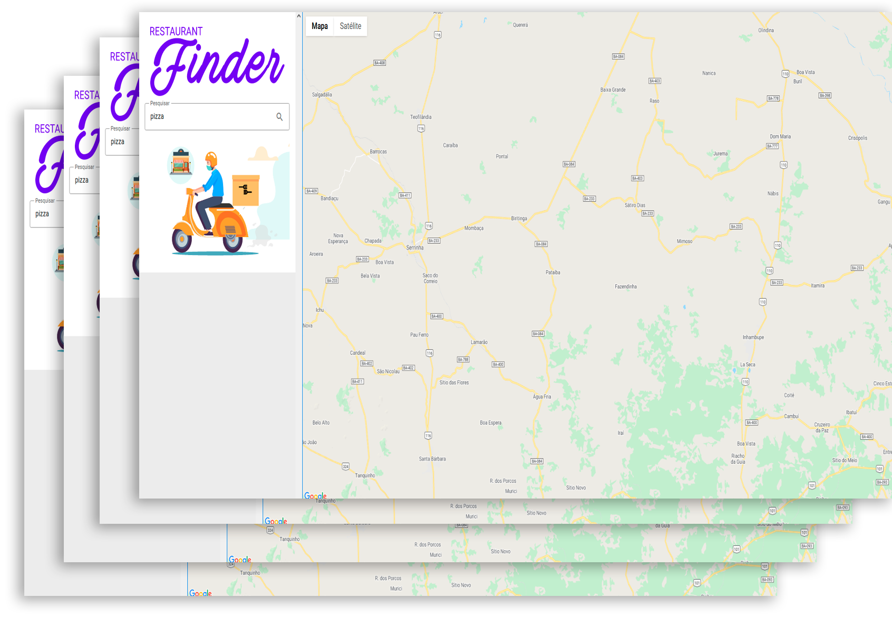

<h2 align="center">
    
</h2>

# Poké Store

👉 **Veja o App em funcionamento**: https://restaurant-finder-mike.netlify.app/

---

O Restaurant Finder é um buscador de restaurantes proximos que utiliza a sua localização para mapear os estabelecimentos e te oeferece um resumo.

O app permite que você **escolha restaurantes**, veja sua **classificação** e **veja sua localização**.

O Finder foi feita com **ReactJS**, utilizando **JavaScript com Redux**, e o acesso aos dados dos restaurantes é feito pela API **Google Maps API**.

---

## 💻 Desktop

<h5 align="center">
  
</h5>

---

## 💾 Instalação

Você precisará ter o **Yarn** instalado no seu computador. Após instalá-lo:
1. Clone o Repositório.
2. Vá até o diretório do Repositório e rode ``yarn`` para instalar as dependências.
3. Rode ``yarn start`` para iniciar o ReactJS.

---

## 🚀 Tecnologias Utilizadas

- ReactJS.
- JavaScript/TypeScript.
- Redux.
- StyledComponents.
